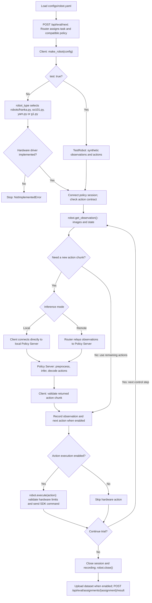

> Detailed Client reference. Run commands from the `colosseum-client` repository root.

## Test data with a real robot identity

```yaml
robot_type: franka # or yam
test: true        # dummy data/actions; false uses the hardware adapter
track: 1          # 1 Open, 2 Fine-tuning
```

`test` must be a YAML boolean. The normal Client command and evaluation workflow
are shared. Dummy local action dimensions follow the Router-assigned model contract;
this is a transport fixture, not a validated YAM hardware interface. Model loading
is still simulated by `colosseum-policy-verify`.

Router persists an immutable test flag per assignment, exposes it in Open and
Fine-tuning reviews, and excludes synthetic results from formal ranking, difficulty
fitting and Fine-tuning summaries. Test attempts do not consume formal trial quotas.
Test and real evaluations use the same registered model pool. Ready messages for
simulation cannot start an assignment marked real. Changing mode during a pending
assignment is supported by restarting normally; the prior unfinished assignment is closed automatically.

Web review is available at `/web/evals` on the Router, with Test badges under
the original robot identity. Historical `robot_type: test` records are retained,
but Legacy test is no longer offered in the robot selector.
The old robot_type test syntax remains accepted for compatibility. New configs
should always use a real robot_type with a separate test flag.

# Colosseum Client

Robot-side client for token-authenticated policy inference through a Colosseum Router.

## Evaluation flow

All robot implementations inherit the `Robot` ABC. The Client shares the
evaluation, transport and recording loop; each robot implements hardware access,
and the Policy Server implements model inference.



Franka uses the existing `DroidRobot` implementation in `robots/franka.py`.
SO101 uses LeRobot (`robots/so101.py`) and YAM uses I2RT (`robots/yam.py`); G1 is a
TODO skeleton and currently stops before opening hardware.
`test: true` bypasses hardware drivers; it does not validate a real robot or
provide a real model runtime. Policy readiness depends on the selected server.
`--no-execute-action` still reads the robot and requests inference.
Once trial resources are initialized, the trial cleanup also runs on errors;
drivers must clean up their own partially opened resources if construction fails.

### HTTP endpoints used by the Client

The HTTP base URL is derived from `router_url`: `wss://host:port` becomes
`https://host:port`, and `ws://host:port` becomes `http://host:port`. Set `api_url`
only when the HTTP API uses a different address. For the example configuration,
the base URL is `https://191.222.219.43`.

Evaluation requests use the Client token and its bound institution:

```http
Authorization: Bearer <client-token>
X-Colosseum-Institution: <URL-encoded institution>
Content-Type: application/json
```

The SDK adds these headers automatically (`Content-Type` depends on the body).
These routes use a Client token, not the admin token. `{assignment}` identifies
the overall evaluation assignment; `{run_id}` identifies one trial within it.

| Method | Endpoint | Purpose |
| --- | --- | --- |
| GET | `/api/health` | Service health; no Client authentication required |
| GET | `/api/eval/tasks?robot_id=so101` | List tasks for Fine-tuning selection; add `&test=true` in test mode |
| POST | `/api/eval/reset` | Close unfinished assignments owned by this Client before a fresh start; changes state |
| POST | `/api/eval/next` | Request an assignment using robot, track, cameras and inference mode |
| GET | `/api/eval/assignments/{assignment}` | Read an assignment when resuming |
| POST | `/api/eval/runs/{run_id}/finish` | Report trial completion in remote inference mode |
| POST | `/api/eval/assignments/{assignment}/result` | Submit the evaluation result |
| POST | `/api/eval/assignments/{assignment}/abort` | Abort an assignment with a reason |
| POST | `/api/eval/runs/{run_id}/dataset` | Register the LeRobot file manifest: paths, sizes and SHA-256 checksums |
| POST | `/api/eval/runs/{run_id}/dataset/upload-url?path={encoded_path}` | Obtain an upload target for one dataset file |
| PUT | `/api/eval/runs/{run_id}/dataset/file?path={encoded_path}` | Upload file bytes when the target storage is local |
| POST | `/api/eval/runs/{run_id}/dataset/complete` | Verify and finalize the uploaded dataset |

Dataset upload follows **register manifest → request targets → upload files →
complete**. For S3 storage, the Client PUTs file bytes to the returned presigned
URL using only its specified headers; it does not forward the Client token to S3.
The `complete` request still goes to the Router. Already verified files can be
skipped when resuming.

The separate video-upload helper also uses these routes:

| Method | Endpoint | Purpose |
| --- | --- | --- |
| POST | `/api/eval/runs/{run_id}/videos/{camera}/upload-url` | Request a video upload target with size and checksum |
| PUT | `/api/eval/runs/{run_id}/videos/{camera}` | Upload MP4 bytes to local storage |
| POST | `/api/eval/runs/{run_id}/videos/{camera}/complete` | Verify completion after an S3 video upload |

Observation images, joint states and returned actions travel over **WebSocket /
Protobuf**, not an HTTP inference endpoint. In local mode,
`/api/eval/runs/{run_id}/local` is a **WebSocket** route for Router preparation and
lifecycle reports (including finish); inference uses `policy_server_url`.
In remote mode, the Client uses the Router WebSocket at `router_url`.

## Integrating another robot

See [Robot adapter integration](robot-adapters.md) for external Python
packages (entry points selected by `robot_type`), `adapter_config`, custom camera roles
and the shared configuration example. G1 is provided as an **unimplemented
template**; it does not control hardware. See the [SO101](so101.md) and
[YAM](yam.md) guides for those drivers. Set only `robot_type: franka`, `so101`, `yam`
or `g1`; no `adapter` selection field is needed.

The shared contract lives in `robot_interface.py`; new hardware implementations
provide `get_observation()`, `execute(action)` and `close()`. Model loading and
inference belong to the Policy Server integration. You can prepare a robot
adapter before its model exists; see the [integration stages](robot-adapters.md#integration-stages-when-inference-is-not-implemented-yet)
for what can be checked at each stage.

## DROID robot

The `--inference-only` robot runner follows an open-loop action-chunk cycle: read RobotEnv, send the
current images and robot state through the WSS Router, then execute each returned action
at 15 Hz before requesting the next chunk. Joint and gripper observations stay separate;
the action uses 7 joint values followed by one gripper value.

```bash
uv sync
cp configs/robot.yaml.example configs/robot.yaml
chmod 600 configs/robot.yaml
# Edit token and institution before running.
uv run colosseum-robot configs/robot.yaml
```

The example defaults to Franka with dummy data (`test: true`) and a local Policy
Server at `ws://localhost:8000`. Start `uv run colosseum-policy-verify` in the
Policy Server project first. Set the Client token and matching Institution.

For real DROID/Franka hardware, set `test: false`, configure camera serial numbers
for `left_image`, `right_image`, and `head_image`, and use a real inference server.
Install the official DROID package with `uv sync --extra franka`, then run with
`uv run --no-sync colosseum-robot configs/robot.yaml`, or combine both steps with
`uv run --extra franka colosseum-robot configs/robot.yaml`.
The extra uses a pinned upstream commit; no fork is required. Robot controller
and camera SDK setup (including ZED/pyzed when used) is still required.

The project's `tool.uv.override-dependencies` replaces DROID's protobuf 3.20.1
pin with `protobuf>=6.33.5,<7` for the Client protocol. See
[uv dependency overrides](https://docs.astral.sh/uv/concepts/resolution/#dependency-overrides).
Installation and DROID runtime compatibility with this override have not yet
been tested. Production deployments must use `wss://`.

For every action, the runner rejects incorrect dimensions and non-finite values,
binarizes the final gripper value at `0.5`, and maintains the registered control rate.
Press Ctrl-C to close the Router session and RobotEnv.

## Robot registration

The Client declares its hardware and action dimensions in the initial `HELLO`:

```python
client = ColosseumClient(
    router_url,
    token,
    client_id="robot-01",
    robot_type="franka",
    joint_count=7,
    has_gripper=True,
    control_hz=15,
    action_spaces={
        "joint_position": 8,
        "joint_velocity": 8,
        "cartesian_position": 7,
    },
)
```

The Router attaches this `RobotSpec` to the matched session. Policy Servers can use it
to select a compatible action space and validate every action chunk dimension.

## Evaluation mode (default)

```bash
uv sync --extra dev
# Install ffmpeg on the robot workstation before recording.
uv run colosseum-robot configs/robot.yaml
```

Actions execute by default in evaluation and `--inference-only` modes. To receive
and print complete action chunks without executing them:

```bash
colosseum-robot configs/robot.yaml --no-execute-action
```

Camera reads, RobotEnv initialization and cleanup still run. Per-step robot I/O
timing logs are disabled; exceptions still propagate to the caller.

The evaluation loop reads one observation at the start of each control step and
requests inference only when the previous action chunk is exhausted. Observation,
inference and execution time all count toward the control period; steps that exceed
the period do not add a sleep. There is no additional read at chunk boundaries. One final observation is recorded
after the last action to capture the ending scene.

Recording uses a dedicated writer thread and a bounded 32-frame queue. The control
loop copies image/state/action buffers and enqueues them without waiting for PNG
compression or disk writes. Actual capture timestamps are retained separately
from the nominal-FPS LeRobot video timeline. At 512×288 RGB, queued pixel data is about 13.5 MiB per camera.
The final frame and all queued writes finish before marking the run finished,
scoring, encoding, or uploading. A full queue or disk error interrupts the trial
with an explicit error instead of silently dropping evidence or stalling control.
Incomplete recordings cannot be encoded by the upload flow.

Older diagnostic trials with `recording-disabled.json` still have no video; use
a normal restart to close those assignments automatically. Explicit `--resume` can submit saved results before starting a new evaluation; use `colosseum-upload-dataset` for deferred uploads.

Choose `1` for Open Track or `2` for Fine-tuning. Open requests a task instruction,
executes server-assigned A, asks for its partial success (0–100), then prompts to
restore the scene and execute B. After B partial success, select A/B/tie and enter
optional feedback. For Open Track, 100% maps to success; lower values map to not
fully successful in the stored result. No separate success/failure prompt is shown.
Fine-tuning obtains the predefined task and anonymous model entirely from the server;
the operator confirms scene setup, runs a trial, and records success/failure and
partial success (0–100). Fine-tuning automatically requests the next assignment;
press Ctrl-C at the next setup prompt to stop. Open asks whether to continue.
No model name is printed by evaluation mode. New evaluation connections verify TLS
normally; the older `--inference-only` runner retains its existing temporary workaround.

The server must have task protocols and policy deployments configured first; see the
router's `EVALUATION.md`. Starting with an empty server produces a no-assignment message,
not invented tasks/models. Use `robot_type: franka` for the existing
Franka/DROID hardware bridge. A standalone Franka without DROID/R2D2 is not yet supported.
`robot_interface.py` defines the observation, action and dimension interface for future robot
backends; adding a YAML robot name alone does not implement its hardware control.

Optional command-line shortcuts:

```bash
uv run colosseum-robot --track fine-tuning
uv run colosseum-robot --track open
uv run colosseum-robot --resume ev_ASSIGNMENT_ID
uv run colosseum-robot --abort ev_ASSIGNMENT_ID
```

`api_url` defaults to the HTTP(S) equivalent of the configured WS(S) endpoint, sharing
the same port. Evaluation uses a **Client token**, not an Admin or Policy token.
Each trial starts only after the operator confirms the initial scene; reset objects
and robot pose as appropriate before A, B, or the next Fine-tuning trial. Press Enter
during execution to end a trial normally; Ctrl-C marks an interrupted session.
`max_trial_steps` controls Open trials and defaults to 800 steps (about 53 seconds
at 15 Hz, plus inference and recording overhead). Fine-tuning limits come from the
server task configuration, whose default is 2700 steps. These are step limits,
not wall-clock timeouts.

Recordings are saved in `evaluation_dir` (default `eval_runs`) with separate assignment,
run, and camera folders. Every action step records RGB images plus timestamp/state/action
metadata. PNG recording and hardware camera reads consume time; confirm the achievable
control rate on the real robot. LeRobot MP4s align one frame per recorded action at
the configured control FPS; capture timestamps preserve actual inference pauses.

The local `manifest.json` records scores, uploaded cameras, and pending final submission.
A result submission failure can be resumed without reexecuting a finished trial or
asking for scores again. After publication, retry failed dataset uploads with
`colosseum-upload-dataset configs/robot.yaml --evaluation-id <evaluation-id>`. Source PNGs, timing records, MP4s, and the manifest are retained.
Starting the client normally always starts a fresh evaluation: it automatically
closes any previous unfinished assignment owned by the same token, including
runs left behind by Ctrl-C, connection loss or a killed process. No manual abort
is required. Completed results are unchanged. Unfinished evaluations stay hidden
from public review and do not consume completed-trial capacity. Local recordings
remain available. Explicit `--resume` still retries a pending finished trial's
result submission before a fresh start; it cannot revive a replaced assignment.


The end-to-end tests use simulated hardware and real local HTTP/WebSocket/ffmpeg video
uploads. They are not validation of physical robot behavior or real S3 credentials.


With `COLOSSEUM_VIDEO_STORAGE=s3` on the router, evaluation MP4s upload directly from
this client to S3 using short-lived presigned URLs. No AWS credentials are needed here.
The client computes SHA-256, uploads the bytes without forwarding its Colosseum token,
then requests server verification. An uploaded camera is marked complete in the local
manifest only after verification. Local storage mode continues to upload to the router.

### Upload to your own dataset

Use the same configuration for a public ModelScope or Hugging Face dataset.
The HTTPS URL selects the provider; `url`/`router_url` still identifies the Router.

```yaml
dataset_url: https://modelscope.cn/datasets/YOUR_ACCOUNT/YOUR_DATASET
# Or: https://huggingface.co/datasets/YOUR_ACCOUNT/YOUR_DATASET
dataset_token: YOUR_WRITE_TOKEN_FOR_THAT_PLATFORM
```

Install the selected SDK with `uv sync --extra modelscope` or
`uv sync --extra huggingface` (pip equivalents: `pip install '.[modelscope]'`
or `pip install '.[huggingface]'`). ModelScope also requires Git.
Create the dataset before uploading. Both providers currently require a public,
ungated repository. The token must belong to the selected platform; tokens are
not interchangeable between ModelScope and Hugging Face.

Alternatively, omit `dataset_token` and use `dataset_token_file: secrets/dataset-token`
(resolved relative to the YAML file), or `DATASET_TOKEN` in the environment.
Provider-specific environment variables `MODELSCOPE_API_TOKEN` and `HF_TOKEN` are
also supported as fallbacks. Use only one explicit token source. Do not commit
credential files. The dataset token stays on Client and is never sent to Router.

With `dataset_url` configured, automatic uploads and `colosseum-upload-dataset`
upload directly to that provider instead of S3/the Router. Each run is stored at
`episodes/{assignment_id}/{run_id}/lerobot/`. `skip_upload: true` still defers
automatic uploads; the manual command uses these same dataset settings.
Leaving `dataset_url` unset retains the original upload behavior. The earlier
unreleased `modelscope_dataset_url`/`modelscope_token`/`modelscope_token_file`
configuration names are replaced by these generic fields.

Client reports the provider, repository and fixed commit to Router. Router
anonymously verifies every file's size/checksum and LeRobot identity before making
footage available through existing review APIs. This requires the updated Router;
old servers reject the preflight before uploading. Files become public on the
selected hub as soon as uploaded and must remain available for playback.

`dataset-upload.json` beside the run's `lerobot/` directory saves a receipt without
credentials. If Router verification fails, rerun the manual upload command to retry
that same revision. Changed content, a different provider, or an already registered
S3/local dataset is rejected; this feature does not migrate registered datasets.

For Fine-tuning, select a predefined task from the server-provided menu after choosing
the track. Only tasks for this robot with remaining trials (or your pending trial)
are listed. The server selects the model; successful rounds continue on the same task.
`--resume FT-ID` keeps the original task. Stop and start again to select another
task; any previous unfinished assignment is automatically closed. This menu requires
a router version with `GET /api/eval/tasks` and `task_id` support.

## Configured evaluation and local inference

`configs/robot.yaml.example` now includes:

```yaml
router_url: wss://router.example.com
token: clt_replace_me
scene: kitchen_01
evaluator: operator_01
track: 1 # 1 = Open, 2 = Fine-tuning
policy_server_url: null # or wss://local-policy.example.com:8000
policy_ping_interval: 20 # Local Policy WebSocket keepalive interval, seconds
policy_ping_timeout: 60 # Pong timeout, seconds; does not change deadline_ms
```

Keep the existing `cameras`, `robot_type`, adapter and control settings in that same
file. `url` remains a supported alias for `router_url`; conflicting values are rejected.
`--track` overrides config; resume uses the saved assignment's track and metadata.
With track and scene set, Open asks only for the instruction before setup confirmation;
Fine-tuning asks for the task. Scoring remains interactive. Scene/evaluator are saved
on Router and in the local assignment manifest; evaluator text does not replace token
ownership. The Router must be upgraded alongside Client for the new request fields.

With `policy_server_url` set, Router chooses the model. Client receives its HF link and pinned revision from
Router and prepares the model through the local WS connection. Observations/actions
travel directly to the local service. Recordings start after readiness, and each
new Trial must reset local model state. Local inference requires evaluation mode;
`--inference-only` with a local URL is rejected.

Run `uv run colosseum-robot configs/robot.yaml`. Existing remote inference remains
available by omitting the local URL. Model loading timeout defaults to 1800 seconds
and can be shortened with `prepare_timeout`. WSS verifies server certificates normally.
The Router token is sent only to Router. This version has no local token setting.

Both policy keepalive settings must be positive integers. They apply only to the
local Policy Server connection; inference still uses `deadline_ms`, and Router
lifecycle heartbeats remain unchanged. See
[`configs/robot.open-local-eval.yaml.example`](../configs/robot.open-local-eval.yaml.example)
for a synthetic local evaluation configuration. Open Track rejects blank instructions.

Local inference failures retain the Policy Server's error code and message and
stop further actions. Cleanup attempts the Client, robot and recorder even if one
close fails; a cleanup failure does not replace an existing trial error.
Failed HTTP responses print a diagnostic and save a private `http-error-*.json`
under `evaluation_dir`. These contain the operation, status, standard HTTP reason
and supported request IDs, without response bodies, URLs or authentication headers.

The local server must implement [Local inference protocol v1](../../colosseum-router/docs/local-policy.md).
The existing Policy Server outbound SDK does not yet implement this inbound protocol.
Client/Router are implemented and mock-tested; a real model-serving implementation
and hardware validation are still needed. Lifecycle reports are queued in the
background; finishing a trial waits for Router confirmation before continuing.

### Verify WSS model delivery without a robot

```bash
.venv/bin/python -m colosseum_client.local_check configs/robot.yaml
```

This uses binary Protobuf through WSS, checks the receipt from the verification-only
Policy Server, and leaves the assignment unexecuted. See
[verification setup](../../colosseum-policy-server/docs/local-verification.md).

### Robot type and a hardware-free local test

Set `robot_type: franka` or `robot_type: yam`. The type is passed to Router for task
and deployment selection, and selects the local robot implementation directly.
YAM remains a TODO hardware implementation. Receipt-only WSS verification supports
either type without instantiating any robot or assuming its action dimensions.
Use `franka`, not the removed `DROID` robot type; remove any `adapter:` field.

From the workspace root, run the automated local test:

```bash
colosseum-router/.venv/bin/python colosseum-router/scripts/run_local_verification.py --robot-type yam
```

Use `--robot-type franka` for Franka. The script starts isolated Router, TLS Policy
Server and Client, registers synthetic task/model data, checks Protobuf delivery,
and shuts everything down. No hardware, GPU, internet download or inference is used.
The three existing development virtual environments and `openssl` are required.
Config, receipt and verification summary paths are printed under a fresh `/tmp`
directory. YAM model URL/action dimensions are synthetic transport fixtures, not a
real YAM model or hardware specification.

### Test robot adapter

All robot types use the same evaluation entry point:

```bash
uv run colosseum-robot configs/robot.yaml
```

`robot_type: test` selects a dummy data/action adapter. It generates RGB and state,
and applies returned actions in memory. Without camera configuration it provides
`head_image`. It uses the same recording, scoring, upload, resume and result flow as
physical robots. `track: 1` runs A then B with partial success and preference;
`track: 2` selects a Router task and runs Fine-tuning evaluation.

Start `uv run colosseum-policy-verify` in Policy Server for simulated model preparation
and actions. Use `policy_server_url: ws://localhost:8000`. Restart the server after
updating. Router records these evaluations under `robot_id: test`; scores and videos
are submitted normally, so filter by robot when viewing results. No hardware executes.
Open Track duration uses `max_trial_steps` (the prepared test config sets 3);
Fine-tuning uses the Router task limit. Enter can finish a trial early.

The separate `python -m colosseum_client.local_check` command remains an explicit
receipt-only diagnostic and is not the normal Client entry point.

### Complete local A/B test (no hardware)

From `colosseum-router`:

```bash
uv run python scripts/run_ab_eval.py
```

Requires the sibling Client development environment and Router test dependencies.
The command launches an isolated Router and mock Policy Server, invokes the actual
Client evaluation workflow with a fake robot, and supplies the operator responses
automatically: A=75%, B=100%, preference=B. It verifies preparation before observations,
different A/B revisions, action reporting, actual MP4 uploads, persisted scores and
idempotent result submission. Services stop automatically; the printed artifact
folder retains the database, prompts, model events, recordings and summary.
No cloud scores or real robot actions are generated.

For real local inference, Policy Server `ready` directly enables Client evaluation.
Router start/step acknowledgments are handled in the background. Completion waits
for Router to persist the trial before scoring and switching models. Real model loading/inference still requires
a Policy Server implementation that emits `ready` after loading the assigned model.

### Institution binding

Set `institution` to the exact value registered for your Client token in Router's
`/admin` token manager. Evaluation requests (including resume/uploads and the
inference control connection) carry this value; Router rejects unbound tokens,
missing values and mismatches. Whitespace around the value is trimmed, but case is
preserved. The stored evaluation institution comes from the token binding.

Every Client token has an Institution. The admin form uses a single Institution
field; new tokens bind it automatically. Existing unbound tokens are migrated using
their original names, while existing bindings are preserved.
To change an existing binding, create a new token. Never infer institution from the
operator-provided scene or evaluator name.

### LeRobot recording

With recording enabled, evaluations export a **LeRobot v3.0** dataset per trial. Update
dependencies with `uv sync`, then run the usual Client command. Configuration:

```yaml
recording: true # default; false disables recording and dataset uploads
```

Each A/B run is a separate one-episode dataset:

```text
eval_runs/<assignment>/<run>/lerobot/
  data/chunk-000/file-000.parquet
  videos/observation.images.<camera>/chunk-000/file-000.mp4
  meta/info.json
  meta/stats.json
  meta/tasks.parquet
  meta/episodes/chunk-000/file-000.parquet
  meta/colosseum.json
```

- `observation.state`: joint positions followed by gripper state.
- `observation.cartesian_position`: the adapter's raw Cartesian pose vector.
- `action`: the selected command for that observation, before execution; this does
  not prove physical execution. Action-space and execution-enabled metadata are
  recorded separately.
- `observation.images.<camera>`: RGB video aligned one frame per recorded action.
- `timestamp`: frame index divided by configured control FPS. This is a nominal
  step timeline, not the actual elapsed wall time; observations are not resampled.
- `observation.capture_timestamp`: original capture time in seconds since the
  recorder started, preserving inference stalls and variable control timing.
- `meta/colosseum.json`: run/assignment identity, task, model (local mode),
  institution, scene, evaluator, per-trial score and synthetic-data flag.

The final observation with no associated action remains in the raw recording; no
action is invented for it. Odd image sizes are padded to even dimensions for H.264.
Statistics are computed from recorded states/actions and source RGB pixels
(including padding); decoded video can differ slightly due to lossy encoding.

During each trial, a background writer saves image frames and state/action
records locally. After that trial finishes and its score is saved, the Client
finalizes its LeRobot dataset before starting the next model. Only uploads wait
until all trials, scores, A/B preference and feedback are complete. Files are
uploaded sequentially after result submission. Scores are published even if the
dataset upload fails or is interrupted; playback becomes available after upload
and verification. Until then, recordings remain on the Client machine. Completed
exports are validated and reused on resume, and failed exports can be retried.
Source PNG/JSONL recordings remain available. This requires a Router version that
accepts results without recordings; update the Router before the Client.
Web review reuses the dataset's videos, so LeRobot mode does
not encode or upload separate review MP4s. With Router S3 storage
enabled, files go directly to the private bucket using signed URLs; the Router
verifies every file's size and SHA-256 before publishing replay. Failed uploads
can be resumed and verified files are skipped. Datasets are not published to
Hugging Face.

The evaluation page retains the standard evaluation video players, using the
LeRobot camera videos at the dataset's nominal FPS. The final observation without
an action remains only in the raw recording. With `recording: false`, inference
and scoring continue, but no images, state/action records, videos or datasets are
saved or uploaded. Assignment metadata and scores still persist locally for
resume. Published results have no playback footage. The flag is bound to the
assignment and cannot change on resume.

Normal usage is unchanged:

```bash
uv run colosseum-robot configs/robot.yaml
```

To submit scores while keeping recordings locally for manual upload, set in
`configs/robot.yaml`:

```yaml
recording: true
skip_upload: true
```

Start the Client normally. `skip_upload` defaults to `false`; setting it to
`true` skips automatic dataset uploads for new and resumed evaluations. Scores
still go to the Router and appear in review without playback. The Router must
support publishing results without datasets. Manual `colosseum-upload-dataset`
commands still upload even when `skip_upload` is `true`.

To upload an already exported dataset without rerunning the robot or changing
its score, use the same owner token and institution:

```bash
uv run colosseum-upload-dataset configs/robot.yaml --evaluation-id <evaluation-id>
```

Omit `--evaluation-id` to upload all exported evaluations in `evaluation_dir`.
The Router must support dataset endpoints, the assignment recording flag, and
`POST /api/eval/reset` before using this Client version.

Older recordings lack gripper state and recording context and cannot be faithfully
exported with the current client. Preserve those source files; do not fabricate
missing state or switch recording off to bypass an existing assignment requirement.

Load a run in a separate environment with LeRobot installed:

```python
from lerobot.datasets.lerobot_dataset import LeRobotDataset

dataset = LeRobotDataset(
    "local/colosseum-run",
    root="eval_runs/<assignment>/<run>/lerobot",
    video_backend="pyav",
)
frame = dataset[0]
```

Format reference: https://huggingface.co/docs/lerobot/lerobot-dataset-v3

Local evaluations request model assignments directly from Router without querying
Policy Server capabilities. Router specifies the model URL, revision and optional subfolder; Client forwards them to Policy Server and waits for preparation progress
and readiness. The verification server still simulates model preparation and inference.

## Cloud LLM keys

Optional `llm_api_keys` maps `openai`, `xai`, and `anthropic` to direct key
strings or `env:VARIABLE` references. Empty/unset references do not enable a
provider. Do not configure `llm_access_token`; it is not used.

The Client sends only the configured provider API URLs in `POST /api/eval/next`.
An updated Router excludes all LLM policies when that list is absent. For a
selected LLM, only its key is sent to the trusted Policy Server in the direct
Protobuf preparation. Credentials require a WSS endpoint or loopback WS through
an SSH tunnel. The Router does not receive or persist provider keys. This flow
currently requires `policy_server_url` (local inference mode).

Models use `model_type`, `name`, and `url`. VLA URLs identify HF repositories;
LLM URLs identify API bases and names are exact API model names. Both use the
existing action contract. Upgrade Client and Policy Server together for the
additive Protobuf fields. An older Client without LLM capabilities remains
eligible only for VLA policies.
